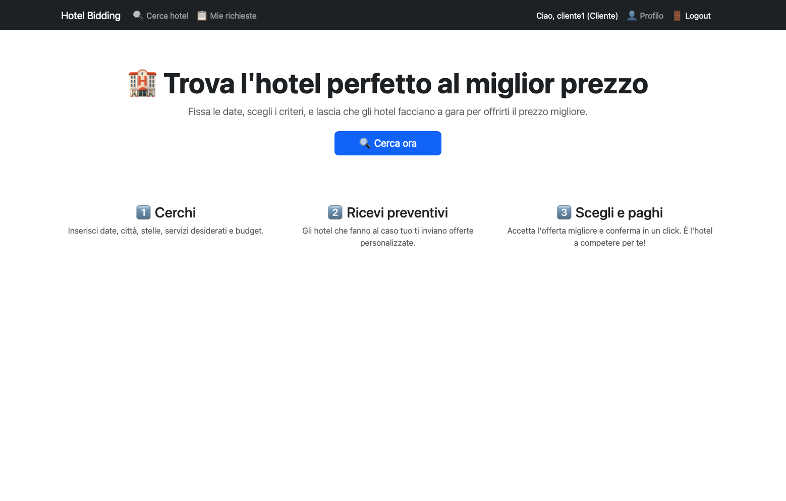
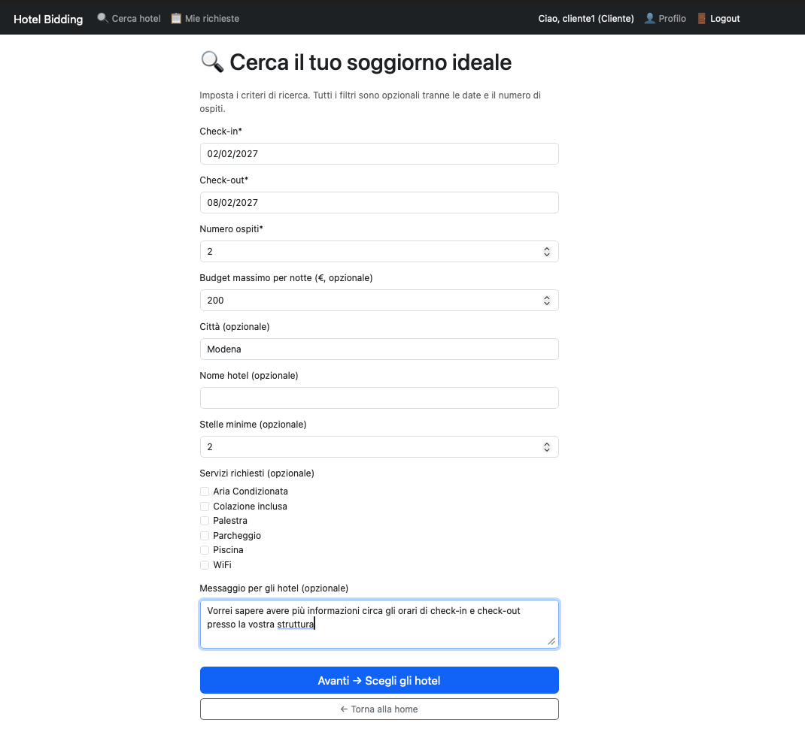
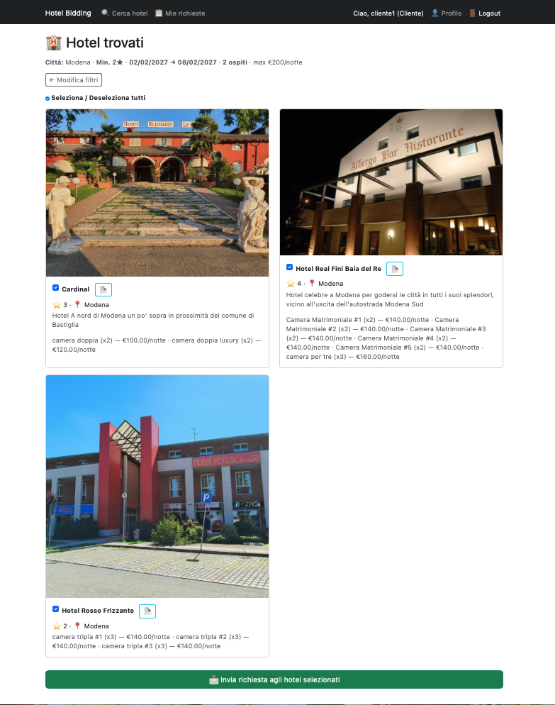
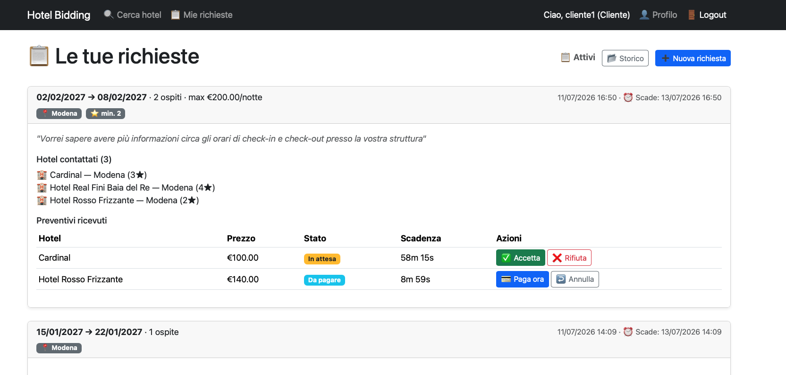
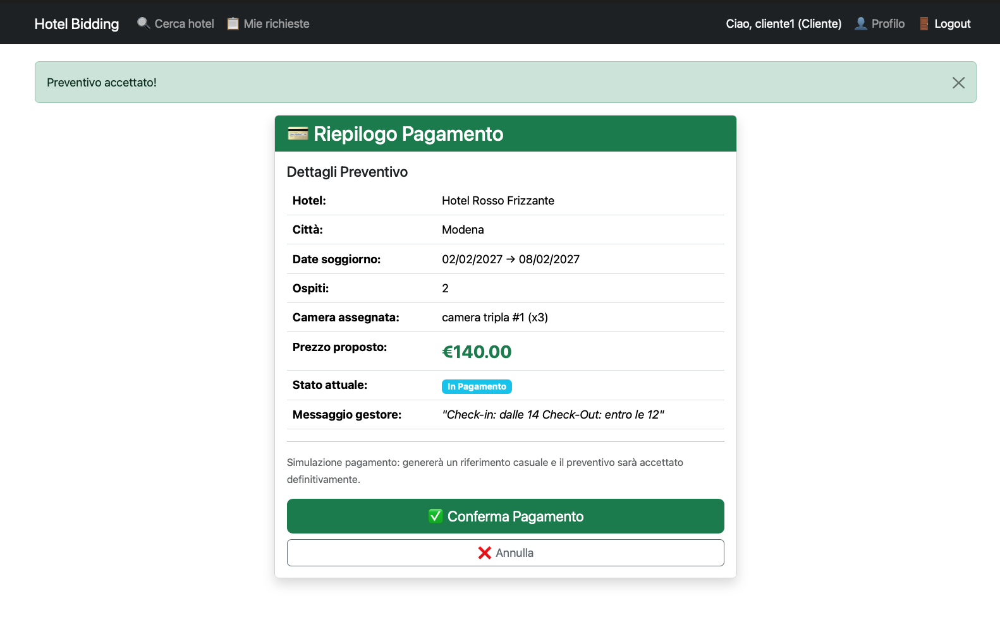
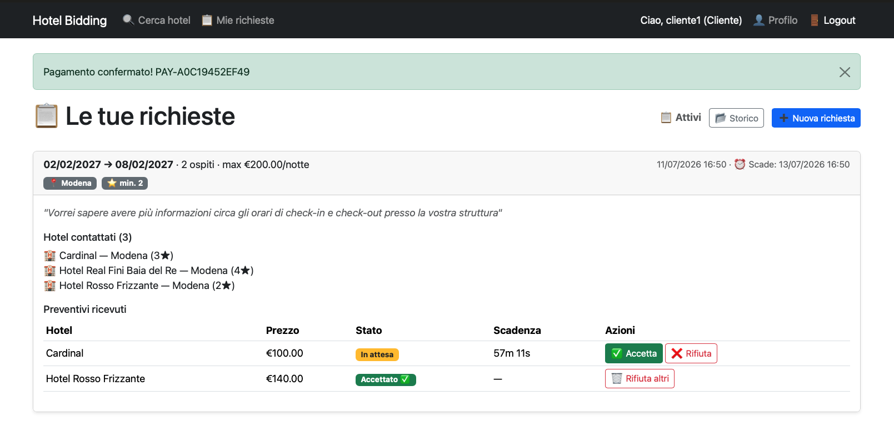
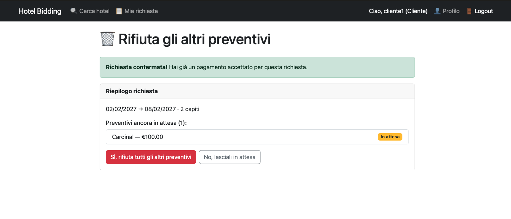
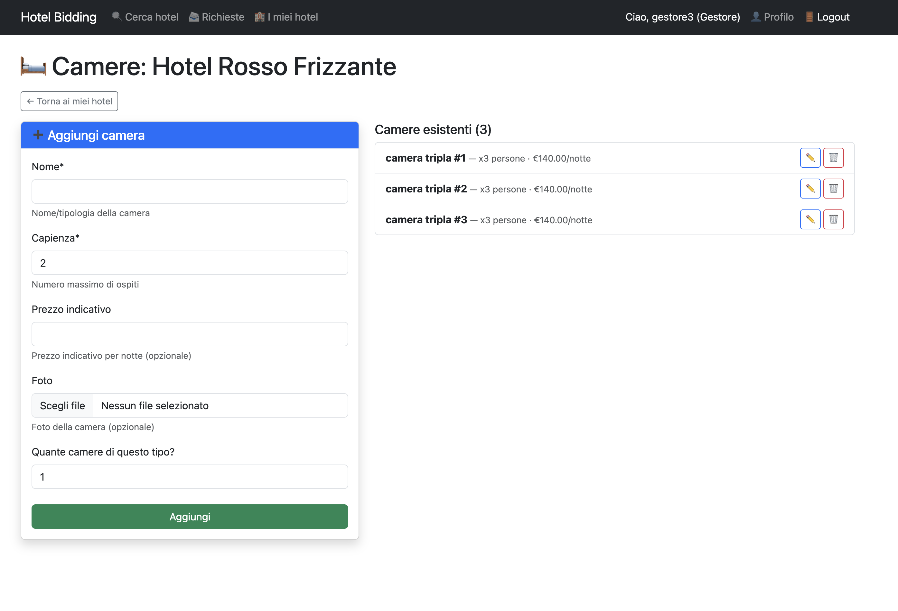
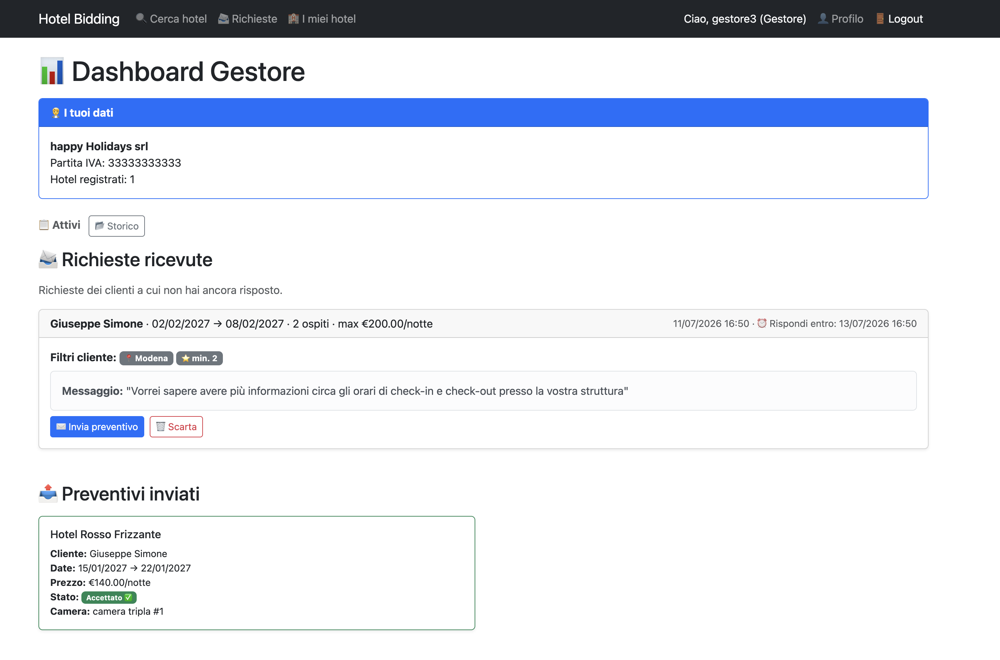
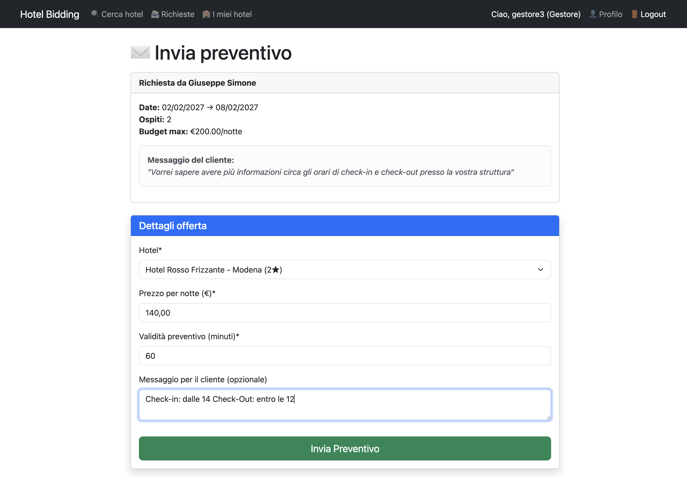

# Hotel Bidding

Piattaforma di prenotazioni alberghiere basata su un modello di **reverse
bidding**: il cliente specifica i propri vincoli di soggiorno (date, numero
di ospiti, budget, servizi desiderati) e sono le strutture alberghiere a
proporre un preventivo, non il contrario.

---

## Indice

- [Come funziona](#come-funziona)
- [Ricerca e filtri](#ricerca-e-filtri)
- [Ciclo di vita di un preventivo](#ciclo-di-vita-di-un-preventivo)
- [Dati di prova](#dati-di-prova)
- [Stack tecnico](#stack-tecnico)
- [Installazione](#installazione)
- [Test](#test)

---

## Come funziona

Il sistema prevede quattro classi di utente.

### Utente anonimo

Può navigare liberamente il catalogo delle strutture (elenco e dettaglio di
ogni hotel) e avviare una ricerca senza essere registrato: compila i criteri
e seleziona gli hotel a cui inviare la richiesta. Solo al momento dell'invio
effettivo viene reindirizzato a login o registrazione — i criteri inseriti e
gli hotel selezionati restano in memoria e la richiesta viene inviata
automaticamente subito dopo l'accesso (o la registrazione), senza doverli
reinserire da capo.


*Homepage con il claim principale e i tre passaggi del funzionamento.*

### Cliente registrato

Ottiene un account cliente registrandosi con i propri dati e un recapito
telefonico. Da qui può:

- compilare una richiesta in due passaggi: prima i criteri (check-in,
  check-out, numero di ospiti, budget per notte, città, nome hotel, stelle
  minime, servizi desiderati, un messaggio libero per gli hotel), poi una
  lista di hotel compatibili e realmente disponibili in quelle date, con una
  casella per struttura più una casella "seleziona tutti/nessuno";
- consultare dalla propria dashboard le richieste inviate e i preventivi
  ricevuti, ciascuno con il tempo residuo prima della scadenza;
- **accettare** un preventivo (avvia il pagamento simulato), **rifiutarlo**
  esplicitamente, oppure **annullare** un'accettazione già avviata prima di
  completare il pagamento;
- dopo un pagamento confermato, scegliere se **rifiutare anche gli altri**
  preventivi ancora in attesa ricevuti per la stessa richiesta;
- modificare i propri dati di profilo (nome, cognome, email, telefono).


*Form di ricerca con i filtri compilati.*


*Lista di hotel disponibili con le caselle di selezione.*


*Dashboard con almeno una richiesta e due preventivi in stati diversi.*


*Pagina di riepilogo/conferma del pagamento simulato.*


*Pagina di riepilogo/conferma del pagamento completato con nuovo stato della dashboard.*


*Possibilità di rifiuto di altri preventivi dopo aver accettato uno.*

### Gestore hotel

Ottiene un account gestore registrandosi con partita IVA e ragione sociale;
in fase di registrazione può opzionalmente creare già la sua prima struttura
(nome, città, stelle, foto). Da qui può:

- creare altre strutture e modificarne i dati;
- aggiungere camere a ciascuna struttura, anche più copie identiche in un
  colpo solo indicando la quantità, ognuna con capienza, prezzo indicativo
  e una propria foto opzionale; modificarle o eliminarle (con avviso se la
  camera è associata a una prenotazione attiva);
- gestire l'elenco dei servizi offerti dalla struttura;
- consultare dalla propria dashboard le richieste compatibili con le sue
  strutture per cui non ha ancora risposto;
- creare un preventivo per una richiesta (prezzo per notte, validità in
  minuti, messaggio opzionale) — il prezzo viene suggerito automaticamente
  in base alla camera più economica compatibile — oppure scartare la
  richiesta;
- modificare i propri dati di profilo e quelli della ragione sociale.


*Screenshot suggerito: pagina di gestione camere di un hotel, con almeno due camere create.*


*Screenshot suggerito: dashboard gestore con richieste in arrivo.*


*Screenshot suggerito: form di creazione preventivo con il prezzo suggerito visibile.*

### Amministratore

Accede al pannello `/admin/` di Django, dove tutti i modelli (utenti,
profili, hotel, camere, servizi, richieste, preventivi) sono registrati e
gestibili direttamente.

---

## Ricerca e filtri

La ricerca del cliente combina più criteri contemporaneamente, tutti
opzionali tranne le date e il numero di ospiti:

- **città** e **nome hotel** (ricerca testuale)
- **stelle minime**
- **servizi richiesti**: un hotel compare solo se possiede *tutti* i servizi
  selezionati, non solo uno qualsiasi
- **budget massimo per notte**: escluse solo le camere con un prezzo
  indicativo superiore al budget; le camere senza prezzo indicato non
  vengono escluse a priori (gestore ha la possibilità di dichiarare un prezzo al momento del preventivo)
- **capienza** e **date di soggiorno**: un hotel compare solo se ha almeno
  una camera con capienza sufficiente e **realmente libera** in
  quell'intervallo, calcolato controllando le sovrapposizioni con le
  prenotazioni già confermate o in corso di pagamento

---

## Ciclo di vita di un preventivo

```
ATTESA ──────────────► IN_PAGAMENTO ──────────────► ACCETTATO
  │                         │
  │                         └─ (timeout o annullamento) torna ad ATTESA
  │
  ├─ validità scaduta ──────► SCADUTO
  │
  └─ nessuna camera disponibile
     per overbooking ────────► INVALIDATO
```

Dettagli implementativi rilevanti:

- L'assegnazione di una camera specifica avviene solo al momento
  dell'accettazione (non alla creazione del preventivo), scegliendola tra
  quelle libere con un lock a livello di database (`select_for_update`) per
  evitare che due accettazioni concorrenti assegnino la stessa camera.
- Il controllo di disponibilità *proattivo* (mostrato nelle dashboard, non
  solo al click) distingue tra un blocco **temporaneo** (un altro cliente sta
  ancora pagando, `IN_PAGAMENTO`) e uno **definitivo** (`ACCETTATO`): un
  preventivo viene invalidato solo se la disponibilità è persa per
  prenotazioni già confermate, non per un pagamento altrui ancora in corso
  che potrebbe non concludersi.
- Il pagamento simulato è idempotente: un doppio invio non genera un
  secondo riferimento di pagamento.

---

## Dati di prova

Per popolare rapidamente il database con hotel, camere, servizi e utenti di
esempio:

```bash
python manage.py crea_dati_test
```

Il comando crea, tra gli altri, un utente gestore e un utente cliente già
pronti per l'accesso:

| Ruolo | Username | Password |
|---|---|---|
| Gestore | `gestore1` | `testpass123!` |
| Cliente | `cliente1` | `testpass123!` |

---

## Stack tecnico

- Python 3.14, Django
- SQLite (sviluppo/test)
- django-crispy-forms + crispy-bootstrap5 per i form
- Pillow per la gestione delle immagini

---

## Installazione

### 1. Clonazione

```bash
git clone <URL_DELLA_REPO>
cd <NOME_DELLA_CARTELLA>
```

### 2. Creazione dell'ambiente — due modalità equivalenti

**Opzione A — Pipenv (consigliata, usa `Pipfile`/`Pipfile.lock`)**

Installazione deterministica, stessa versione delle dipendenze usata in
sviluppo. Richiede Python 3.14 installato sulla macchina.

```bash
pipenv install
pipenv shell
```

**Opzione B — venv + requirements.txt**

```bash
pipenv install -r requirements.txt
pipenv shell
```

### 3. Database

```bash
python manage.py migrate
```

Facoltativo, per avere subito dati con cui navigare:

```bash
python manage.py crea_dati_test
```

Facoltativo, per creare un account amministratore:

```bash
python manage.py createsuperuser
```

### 4. Avvio

```bash
python manage.py runserver
```

Il sito è disponibile su `http://127.0.0.1:8000/`.

---

## Test

```bash
python manage.py test
```
